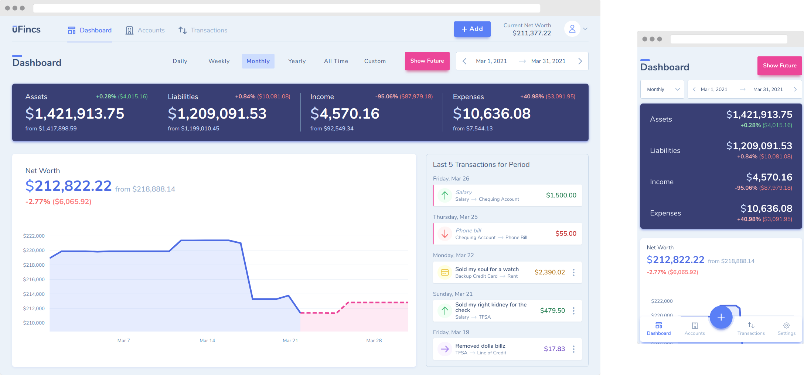

<div align="center">
  <a href="https://ufincs.com"></a>
</div>

# uFincs

The buzzwordy way to describe [uFincs](https://ufincs.com) is as a "privacy-first, encrypted personal finance app". But really, it's just an app that I built to scratch my itch. It's my take on a personal finance app that is very much in the vein of GnuCash: manual transaction tracking using double-entry accounting. 

Of course, it has that modern 'flair' that GnuCash is distinctly lacking (being a responsive web app with a nice UI that works offline-first) while still trying to retain some of what makes GnuCash great (double-entry accounting, ownership of data).

Try out the free "no-account" mode [here](https://ufincs.com/noaccount) to get a feel for the complete experience without having to sign up. Or, jump straight into the [user docs](docs/user/README.md) to learn how to host uFincs yourself.

**Looking for the full git history?** It's over [here](docs/oldGitHistory.txt).

## Table of Contents

- [About uFincs](#about-ufincs)
  - [Tech Stack](#tech-stack)
  - [Security](#security)
- [Getting Started](#getting-started)
- [Repo Structure](#repo-structure)
- [Contributing](#contributing)
- [Roadmap](#roadmap)
- [License](#license)
- [Founders](#founders)

## About uFincs

<div align="center">
  
</div>

If you want the marketing spin on what uFincs is (and more screenshots), go check out the [marketing site](https://ufincs.com).

For the more technically minded, uFincs is a personal finance app with the following characteristics:

- **It's a web app**
  - Specifically, it's an offline-first PWA. That means that once you're logged-in, you can use the app without an internet connection. Heck, you can even use the app without an account!
- **It encrypts your data**
  - All data is encrypted in-browser (or in-app) before it is sent off to be persisted in the backend database. This provides a layer of security that few other apps can boast.
- **It forces you to enter transactions manually**
  - You won't find any bank syncing here like other finance apps do. Nope, uFincs is built on the principal of tirelessly tracking each and every penny — _by hand_.
- **But it does support CSV import...**
  - This is one of the concessions to the 'manual tracking'. Grab a CSV of your transactions from your bank and you can import them directly into the app.
- **... and recurring transactions**
  - OK, we're not completely heartless about the 'enter everything manually' goal. Recurring transactions certainly help cut down on some of that work.
- **It also kinda allows custom integrations**
  - What? You _really_ want bank syncing? Fine, check out the [api-proxy-prototype](https://github.com/uFincs/api-proxy-prototype) to learn how you can build your own custom bank syncing integration. Just know that it'll never be supported as a first-class feature :)
- **It supports precisely one currency**
  - You can change which currency symbol is displayed throughout the app, but there is no multi-currency support in uFincs.

What does uFincs _not_ do (and likely will never do)?

- **Bank syncing**
  - This was addressed above.
- **Multiple currencies**
  - Also addressed above.
- **Budgeting**
  - Double-entry accounting or bust.
- **Track stock prices**
  - ... or do any other kind of 'external' integration for that matter. uFincs is a self-contained system; if you want custom external integrations, you can build them yourself (using, for example, the [api-proxy-prototype](https://github.com/uFincs/api-proxy-prototype) as a base).
- **Native App Support**
  - uFincs is only a web app. There is no intention to have official Android/iOS/desktop apps.

If you want to read more about the history of uFincs, I suggest starting with the [uFincs Update](https://www.onmattersconcerningmyexistence.com/p/ufincs-update-1) series of blog posts.

### Tech Stack

- **Infrastructure Framework:** (formerly) [Kubails](https://github.com/DevinSit/kubails)
- **Production Infrastructure:** (formerly) Kubernetes (GKE) on Google Cloud Platform (GCP), now Cloud Run (Backend) + Firebase Hosting (Frontend)
- **Frontend:**
  - **Language:** TypeScript
  - **Framework:** React + Redux + redux-saga, Vite
  - **Styling:** Plain old Sass
  - **Testing:** Jest, Cypress, Storybook
  - **Linting:** ESLint, Prettier
- **Backend:**
  - **Language:** TypeScript/Node
  - **API Framework:** Feathers.js + Express
  - **ORM:** Sequelize (backed by Postgres)
- **Marketing site:**
  - **Language:** Plain JavaScript
  - **Framework:** React, NextJS
  - **Styling:** Tailwind CSS + Sass
- **Database:** Postgres

### Security

Want to learn more about the security aspects of uFincs? Check out the [security guide](https://ufincs.com/policies/security) on the marketing site.

## Getting Started

Do you want run/self-host uFincs? Check out the [user docs](docs/user/README.md).

Do you want to develop/extend/fork uFincs? Check out the [dev docs](docs/dev/README.md).

## Repo Structure

Want to just poke around? Here's a quick overview of the repo structure. Most sub-folders have their own README for more in-depth explanations.

```
├── cloudbuild.yaml   # Cloud Build (CI/CD) pipeline for production GCP infrastructure
├── docs/             # Misc repo-level documents/images
├── helm/             # Helm templates used to generate the Kubernetes manifests (using Kubails)
├── kubails.json      # Kubails configuration file
├── Makefile          # Makefile that contains the primary commands for controlling the repo
├── manifests/        # Where the Kubernetes manifests are stored/generated to
├── scripts/          # Misc scripts that enable operation of the repo
├── services/         # All of the actual application code, divided up into Kubails services
├── terraform/        # Terraform config for the production GCP infrastructure (used by Kubails)
└── terraform-aws/    # Terraform config for the production AWS infrastructure (for database backups)
```

## Contributing

Like any other good open source project, uFincs is open to contributions. Just make sure to follow the rules and guidelines in the [CONTRIBUTING](CONTRIBUTING.md) file.

## Roadmap

Frankly, uFincs has met and exceeded my own expectations and use cases. As such, it does not have an active roadmap — I just work on what I want when I feel like it.

## License

This project is licensed under the MIT License — see the [LICENSE](LICENSE.md) file for details.

## Founders

- [Devin Sit](https://github.com/DevinSit)

Special shout-out to [Dominic Roy-Stang](https://github.com/DominicRoyStang) for helping build the first uFincs prototype and being supportive all along the way :)
